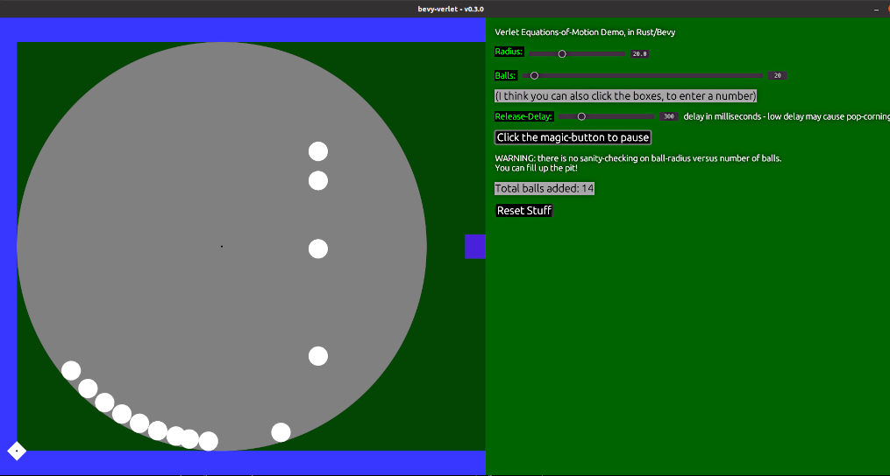

### kivy_verlet_sample

Inspired by the excellent video:

- https://www.youtube.com/watch?v=lS_qeBy3aQI
- (How to program a basic Physic Engine by Pezzza's Work)

This is a quick demo of the basic Verlet equations for object-motion,
implemented in Rust + Bevy. (Uses Rust 1.62.1/Bevy 0.8.0). Now also
integrates Egui, an immediate-mode GUI with bindings for Bevy, to add
some widgets.

Note - I did another version of this in Python/Kivy, but not surprisingly,
it was only able to handle 100-150 balls without dropping framerate. The
Rust/Bevy version handled 500+ balls at 60 FPS, that I've tested.

### Currently
 - Verlet Engine
   - multi-ball collisions working
   - one circular constraint enabled
   - gravity working its magic
 - ball-release on timer (fairly slowly, or incoming balls smash previous ball)
 - collision-damping funky, some popcorn-effects at times
 - at 500 balls, holding at 60 FPS - I added some pre-collision filtering, anyway
   - the FPS can handle more than 500 balls, but there's some other weirdness with that many, alas
 - has a simple control-panel using Egui widgets
   - sliders, to set ball-count/ball-radius/ball-release delay
   - buttons, to pause/reset
 - has basic Game State logic, cycled by GUI buttons
 - upscaled GUI widgets, larger/more readable
 - added WASM support, so it runs in the browser
   - app too large, have to hit < CTRL>- a few times to see it

### Warning
Now that ball-radius is adjustable, I'll comment that there's no sanity-checking
on size of balls versus pit - it's possible to fill up the pit. Per the license,
management is *not* responsible for any burned-up CPUs.

### TODO
 - make app resize for browser-window
 - change collision-logic to handle balls of different radius
 - change balls to have different radii (sort done, the slider can be changed mid-release!)
 - figure out how to spawn balls on timer, without instant collisions
 - experiment with dampening, to get less "dynamic" collisions
 - add static balls for pinball-effect
 - add links for some chaining
 - move more parameters to control-panel

### To Run
You don't have to use `release`, but a `debug` compile, takes a few seconds
longer to load the background bitmap.

    cargo run --release

### Output
